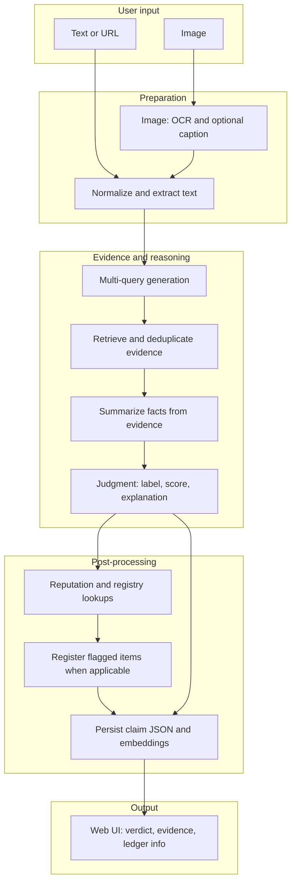

# Project Report: Fake News Detection Platform

This document provides an overview of the Fake News Detection Platform for academic or technical reporting: purpose, impact, architecture, functionality, and operational flow. Integration details are described at a high level as a custom full-stack system.

---

## Scope of the full project

The main deliverable is a **multilingual, multimodal fact-checking platform** documented in the repository root `README.md`.

| Area | Role |
|------|------|
| `code/` | Core verification pipeline, persistence, application server, image and text tooling, media-authenticity checks |
| `bangla-fact-check-main/` | React 19 + Vite + Tailwind user interface (Bengali-first) |
| `ethereumFake-main/` (companion) | Decentralized **blockchain registry** (Solidity on Ethereum test network + Flask bridge) for immutable URL and publisher records |

For a **single integrated system** narrative, treat `code/` and `bangla-fact-check-main/` as the primary platform and `ethereumFake-main/` as the **trust and transparency layer** supporting registry semantics referenced in the user interface (transaction references, reputation counts).

---

## 1. What the project is about

This is a **fake news detection / fact-verification platform** that helps users **assess claims** given as plain text, web links, or images. It combines:

- **Retrieval-augmented reasoning**: The system gathers external evidence, condenses it, and produces a structured verdict (for example: verified content, false or misleading material, uncertain cases) with an explainable rationale and a credibility-oriented score.
- **Multimodal input**: Images are converted to analyzable text through optical character recognition and optional visual description, then follow the **same verification path** as text and URLs.
- **Traceability**: Each run can be **persisted locally** as structured records (claim identifier, evidence, classification, optional metadata associated with the blockchain registry).
- **Citizen-facing tools**: Reverse-image style assistance, image metadata inspection, and a separate **AI and synthetic-media detection lab** for images and short videos.

The in-product explanation aligns with this flow (`bangla-fact-check-main/src/components/Methodology.jsx`: data gathering, AI analysis, and on-chain storage of verification-related records).

---

## 2. Impact

- **Misinformation and rumor control**: Offers a **structured assessment** rather than an informal guess, with evidence-style source lists that support transparency.
- **Language inclusion**: A **Bengali-first interface** with English support addresses users in regions where similar tools are often English-only.
- **Multimodal use**: Social content mixes **screenshots, memes, and links**; a unified text-and-image pipeline matches real sharing behavior.
- **Accountability signals**: Optional **publisher and URL reputation** and **blockchain-backed registration** for flagged cases support **auditability** (hashes and counts surfaced in the UI in components such as `FactCheck.jsx` and `Home.jsx`).
- **Synthetic media awareness**: The **AI Detection Lab** targets **AI-generated and manipulated** imagery and video—a growing class of misinformation.

---

## 3. How it is built

The system is a **custom full-stack application** with clearly separated layers:

- **Presentation layer**: Single-page application with client-side routing (`bangla-fact-check-main/src/App.jsx`): Home, Fact Check, Tools, AI Detection, How it Works, and per-claim detail routes.
- **Application server layer**: Python service (`code/api.py`) coordinates verification, file uploads, claim retrieval, investigation-tool handlers, and media-authenticity analysis. During development, the frontend dev server proxies requests to the backend (`bangla-fact-check-main/vite.config.js`).
- **Verification engine**: Central orchestration in `code/fact_check_llm.py`—query formulation, evidence collection and deduplication, summarization, verdict parsing (including multilingual keyword heuristics), scoring, and coordination with storage and the registry bridge.
- **Image pipeline**: `code/image_fact_checker.py` handles uploads, OCR (with configurable backends), optional captioning, and passes derived text into the same verifier.
- **Persistence**: `code/claim_storage.py` manages JSON claim records, optional **semantic embeddings** for similarity, snapshots, and flagged-source data under `code/claim_metadata` and related directories.
- **Trust / registry bridge**: `code/blockchain_registry.py` encapsulates registration and lookup against the deployed registry service (conceptually a **blockchain bridge** to the immutable registry).
- **Legacy interface**: `code/app.py` (Gradio) remains available for quick experiments (see `README.md`).
- **On-chain registry stack (companion)**: `ethereumFake-main` documents smart contracts and a bridge service for **immutable** news-source records on a public test network.

Configuration (credentials and service endpoints) is supplied through environment settings alongside the code, without requiring vendor-specific detail in this report.

---

## 4. Functionalities the system provides

**Fact checking** (`bangla-fact-check-main/src/components/FactCheck.jsx`)

- Input modes: **text claim**, **URL** (content retrieved and normalized on the server), **image upload**.
- Output: classification (verified / false / misinformation / unsure in the UI), **credibility score**, **rationale**, **evidence source list**, **publisher reputation context**, **blockchain transaction link** when registration succeeds.

**Claims browsing and detail** (`Home.jsx`, `ClaimDetail.jsx`)

- **Trending** and **recent** claim lists from stored metadata.
- Deep link **`/claim/:id`** for a single record with full verdict, evidence, and metadata.

**Tools** (`Tools.jsx`)

- **Reverse image search**: Deep links to major image search surfaces (e.g. Google Lens, Google Images, TinEye, Yandex) from URL or upload; backend helpers in `code/api.py` under `/api/tools/...`.
- **Image metadata**: EXIF and structured camera and location fields extracted server-side (`_extract_structured_metadata` in `code/api.py`).

**AI Detection Lab** (`AIDetect.jsx`)

- Image: upload or URL.
- Video: upload with a stated size limit (50 MB in the UI).
- Returns **AI-generation** and **deepfake** signals and a summarized verdict.

**User experience**

- Dark/light theme and **Bengali / English** language toggle (`Navbar.jsx`).
- **How it works** educational page (`Methodology.jsx`).

---

## 5. How it works (end-to-end)

### Working flow diagram

### Step-by-step narrative

1. The user submits **text**, **URL**, or **image** through the React application.
2. The **application server** handles the request: for **URLs**, page text is retrieved; for **images**, **OCR and captioning** produce text that enters the **same verifier** as headlines or posts (`image_fact_checker.py` → `fact_check_llm.py`).
3. **Non-Bengali** input may be aligned for the pipeline via a **translation step** inside the verifier (reporting language: “language alignment”).
4. The engine **generates search queries**, **retrieves** candidate documents, **deduplicates and ranks** them (including semantic similarity where configured), then **compresses** evidence into concise notes.
5. A **reasoning step** yields **label**, **numeric credibility**, and **explanation**; output is parsed with safeguards (Bengali and English keyword sets in `fact_check_llm.py`).
6. For **false or misinformation** outcomes, the system may **flag sources**, **look up prior reputation**, and **record** entries through the **registry bridge**; results are merged into the **claim record** (`claim_storage.py`).
7. The **UI** shows classification, score, evidence, publisher counts, and an optional **block explorer link** for registered transactions.

**Parallel paths — Tools and AI Lab:** Reverse-image and metadata flows use dedicated server handlers. AI and synthetic-media detection uses a **separate media analysis path** (handlers in `code/api.py`) and returns **scores and verdict** to `AIDetect.jsx`.

---

## 6. System architecture diagram

High-level view of major subsystems and data paths (no vendor-specific integration detail). The diagram reflects how the repository is actually structured: two user-facing clients, a FastAPI-style application server for the React app, a decomposed verification pipeline, separate tool and media-forensics paths, layered persistence, and the companion registry stack before the ledger.

```mermaid
flowchart TB
  subgraph presentation [Presentation tier]
    Browser[Web browser]
    SPA[React SPA Vite Tailwind]
    GradioUI[Legacy Gradio UI app.py]
  end

  subgraph gateway [Application gateway]
    AppServer[Python application server api.py]
  end

  subgraph verifyPipeline [Verification pipeline]
    Orchestrator[Verification orchestrator fact_check_llm]
    UrlExtract[URL and HTML content extraction]
    LangAlign[Language alignment and normalization]
    Evidence[Evidence gathering query and fetch]
    SemProc[Semantic deduplication and ranking]
    Reason[Evidence summarization and verdict reasoning]
  end

  subgraph imagePipeline [Image processing]
    ImgMod[Image pipeline image_fact_checker]
  end

  subgraph auxiliary [Auxiliary analysis]
    ToolsSvc[Investigation tools reverse image and metadata]
    MediaLab[Media authenticity analysis]
  end

  subgraph persistLayer [Persistence layer]
    ClaimMgr[Claim storage manager claim_storage]
  end

  subgraph data [Local data tier]
    JsonStore[Claim metadata JSON]
    Snapshots[Claim snapshots]
    Flagged[Flagged sources store]
    ImageStore[Uploaded images and image metadata]
  end

  subgraph extKnowledge [External knowledge]
    WebCorpus[Public web and reference pages]
  end

  subgraph trust [Trust tier]
    RegClient[Registry bridge blockchain_registry]
    RegBackend[Companion registry backend Flask Web3]
    Chain[Immutable public ledger smart contracts]
  end

  Browser --> SPA
  SPA --> AppServer
  GradioUI --> Orchestrator

  AppServer --> Orchestrator
  AppServer --> ImgMod
  AppServer --> ToolsSvc
  AppServer --> MediaLab
  AppServer --> ClaimMgr

  Orchestrator --> UrlExtract
  Orchestrator --> LangAlign
  Orchestrator --> Evidence
  Evidence --> WebCorpus
  Evidence --> SemProc
  SemProc --> Reason

  ImgMod --> Orchestrator
  ImgMod --> ImageStore

  Orchestrator --> ClaimMgr
  Orchestrator --> RegClient
  Reason --> ClaimMgr

  ClaimMgr --> JsonStore
  ClaimMgr --> Snapshots
  ClaimMgr --> Flagged

  RegClient --> RegBackend
  RegBackend --> Chain
```

**What this diagram adds** (relative to a single “verification engine” box): **dual clients**—the production React app talks to the application server, while the **legacy Gradio** interface calls the same verification and image modules directly; **verification internals**—URL extraction, language alignment, evidence acquisition from public sources, semantic processing, then summarization and judgment; **image pipeline** persistence to **image files and sidecar metadata**; **persistence split** into **claim records**, **snapshots**, and **flagged-source** indexes; **auxiliary** branches for **investigation tools** and **synthetic-media analysis** without merging them into the main fact-check chain; **trust chain** showing the **in-repository companion registry service** (`ethereumFake-main`) between the bridge client and the **on-chain ledger**.

---

## 7. Companion blockchain registry (`ethereumFake-main`)

The `ethereumFake-main` component implements a **decentralized fake news registry** on an **Ethereum test network**: smart contracts store URL and publisher associations immutably, with duplicate prevention and administrator-controlled registration. A **Flask** bridge connects clients to the ledger via **Web3**, including fee estimation and error handling. In the overall platform, this stack backs the **immutable audit trail** that the main application references when surfacing transaction identifiers and reputation-related counts in the UI.

---

## 8. Optional diagram assets in the repository

The repository also contains `code/architecture.mmd` and `code/architecture_diagram.py` for generating architecture figures. Those assets may name specific external components; for report wording consistent with Sections 5–6, prefer the diagrams above or regenerate them with generic labels.

---

## 9. Report boundaries (for your institution)

- **Scope choice**: “Platform only” (`code/` + `bangla-fact-check-main/`) versus “Platform + blockchain registry repository” (`ethereumFake-main/`).
- **Evaluation**: Project-wide benchmark scripts are not centralized in `README.md`; any accuracy or F1 study would be added as separate experiments in your report.
